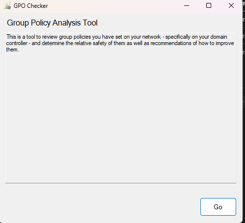

# GPO Checker

GPO Checker is a vulnerabilities scanner, to check the misconfigurations in the Group Policies within the Active Directory domain.

## Contributors

| Contributor | Description |
|--|--|
| [@georgeatgrayson](https://github.com/georgeatgrayson) | Original developers of GPO Checker |
| [@TheFlightSimsOfficial](https://github.com/TheFlightSimsOfficial) | Contributor |
| [@shiroinekotfs](https://github.com/shiroinekotfs) | Contributor |

## Use GPO Checker

> Note: Always run GPO Checker with Administrator privilege

Once it's running, click `Go` then wait for a minute for the GPO Checker scan all policies.

> If you're not running the application on the computer not joined into a domain, nor the domain cannot be contacted, GPO Checker won't check the policies, and return the error.
