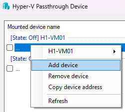
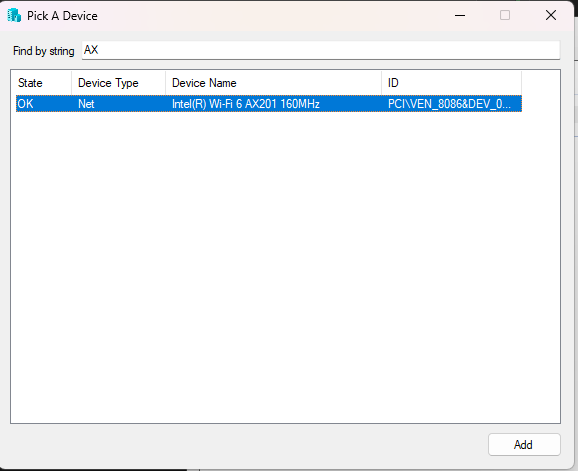
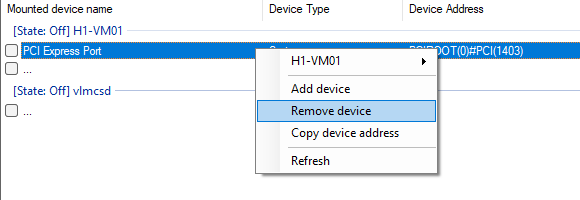
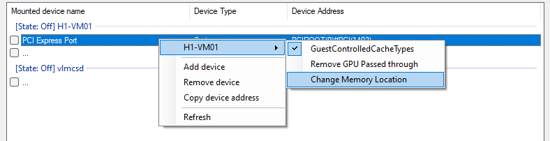

# Hyper-V Device Passthrough

Hyper-V Device Passthrough allows Hyper-V virtual machines can use hardware directly, without using software bridge.

## Contributors

| Contributor | Description |
|--|--|
| [@chanket](https://github.com/chanket) | Original developers of GPO Checker |
| [@TheFlightSimsOfficial](https://github.com/TheFlightSimsOfficial) | Contributor |
| [@shiroinekotfs](https://github.com/shiroinekotfs) | Contributor |

## Use Hyper-V Device Passthrough

> Note: Please always run this software with Administrator privilege

### Getting started

Once you run the Hyper-V Device Passthrough application, the app will appear with pre-created virtual machines, with its name and state.

In each virtual machine, the row below shows all mounted devices, its type and address.

### Mount a device

> Note: Make sure your selected virtual machine state is `Off`. If not, shut down this virtual machine. Also, the target device must be in idle state to prevent BSOD while passing.

Right-click on the selected machine, then select `Add device`. A windows will appear to let you select your device

> You can try to search for a device name, or device type using `Find by string`

Select your target, click add, confirm, and you're done!

> Note: For GPU, the process requires accepting the risk of mounting your GPU into (DDA procedure). Read the instruction carefully.

### Unmount a device

If you've mounted a device into a virtual machine, and you want to unmount/delete that device, right-click the select device, then click `Remove device`

> Note: Make sure your selected virtual machine state is `Off`. If not, shut down this virtual machine. Also, the target device must be in idle state to prevent BSOD while passing.

### (Advanced) Set High-space memory

In DDA procedure, it's required that the high-space memory must be configured properly.

