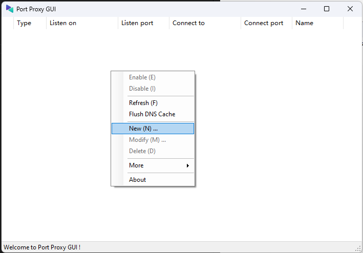
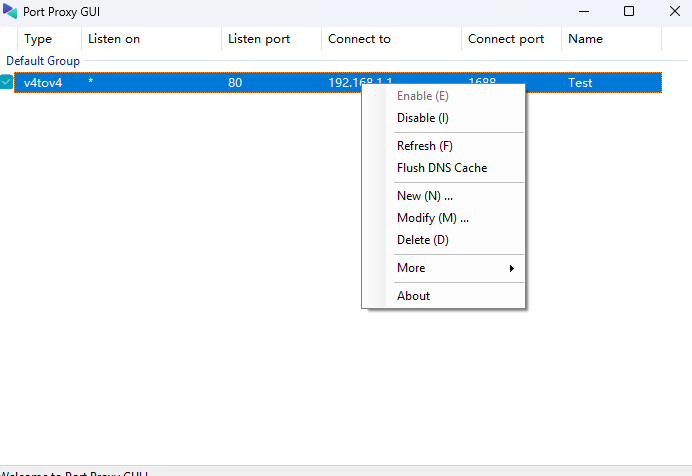
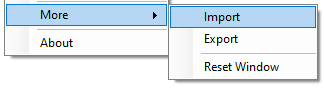

# PortProxyGUI

PortProxyGUI is a port export and proxy director for Windows and Windows Server, especially for forwarding application and between web servers within the network, or LDAP.

## Contributors

| Contributor | Description |
| -- | -- |
| @[zmjack](https://github.com/zmjack) | Original developer of PortProxyGUI |
| @[shiroinekotfs](https://github.com/shiroinekotfs) | Contributor |

## Use PortProxyGUI

> Note: Please always run this software with Administrator privilege

### Getting started

Once you're in, you  will see the main interface as shown above. Right-click for displaying and configuring your proxy settings

* Click "New (N)" to add a new rule, then you can set the Rule Name, Listen on IP address with its port and forwarding port. After that click "Set", the application will make the proxy between the requested port and the real application port.

* Disabling or Enabling a rule will stop or start the corresponding port forwarding process on your computer.

Backing up and Restoring  rules are performed by exporting and importing `.db` files, which contain all the information about the connection and its port forwarding to.

